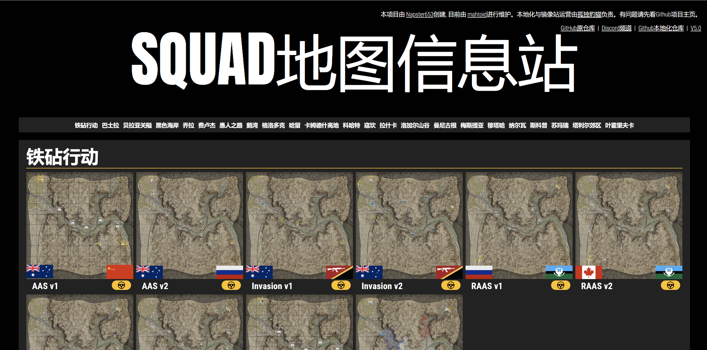
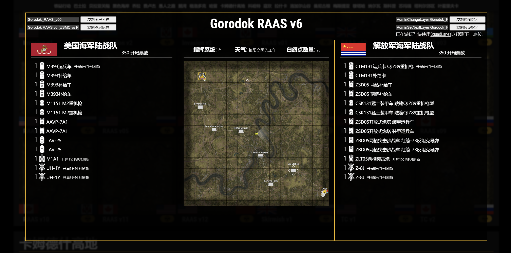
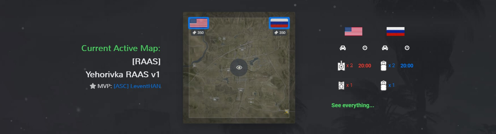

[![Forks][forks-shield]][forks-url]
[![Stargazers][stars-shield]][stars-url]
[![Issues][issues-shield]][issues-url]
[![GPL License][license-shield]][license-url]

  <h2>Squad地图信息站</h2>

  

    一站式查看Squad的地图与图层信息！
     
    <a href="https://discord.mahto.id/">加入Discord频道</a>
    ·
    <a href="https://github.com/mahtoid/SquadMaps/issues/new?assignees=&labels=bug&template=bug-report.yml">上报Bug给原项目</a>
    ·
    <a href="https://github.com/mahtoid/SquadMaps/issues/new?assignees=&labels=enhancement&template=feature-request.yml">在原项目请求更多功能</a>
  

---
## 关于
SquadMaps 是一个用于展示《Squad》游戏中所有地图和图层的网站。

每个地图/图层都包含以下信息：
- 队伍信息（名称和初始票数）
- 车辆信息（名称、数量和刷新延迟）
- 图层信息（天气、指令和地图占领点的数量）
- 以及其他更多！

### 另声明
本项目(SquadMapsChineseVersion)作为SquadMaps的一个fork分支，经过部分，一些部分会与母项目不同。

---

## 使用说明
要使用 SquadMaps，请访问 https://squadmaps.cn (本地化网站) 或 https://squadmaps.cn (原站)！

你可以从网站顶端的导航模块快速查看你想要查看的地图，以及可以概览到所有不同图层的信息，点击“驾驶员”职业图标以获取更多详细信息。(如载具，天气等)

---
## 常见问题说明 

#### Q1:为什么中文站点和英文站点有差别？
##### *A1:本地化站点除开翻译以外，还改进与添加了其他功能。*

#### Q2:为什么我在网站里看到的载具译名与游戏里不一致？
##### *A2:个人翻译与游戏内有出入，敬请谅解，之后会不断更新比对完善*

#### Q3:对移动端适配太差了吧！电脑好好的一放到手机上就拉大胯！
##### *A3:emmm对不起，个人暂时没有这个能力去对移动端做适配，还请麻烦各位用电脑访问，非常感谢。*

---
## 截图

<b>网站主页</b>

<b>地图信息界面</b>

    

---
## 附加功能(母项目)
您可以使用 modal.js 中的对象，自行开发出例如图示这样的可视化地图统计：

---
## 归属说明

- *本项目从 [Squad Wiki Editorial](https://github.com/Squad-Wiki-Editorial/squad-wiki-pipeline-map-data) 中借用了捕获的地图数据。*
- *本项目从通过 Steam 上获取的《[Squad](https://joinsquad.com)》游戏文件中借用了图标、地图背景和游戏信息。*

<!-- LINK DUMP -->
[language-dom]: https://img.shields.io/github/languages/top/mahtoid/SquadMaps?style=for-the-badge
[forks-shield]: https://img.shields.io/github/forks/mahtoid/SquadMaps?style=for-the-badge
[forks-url]: https://github.com/mahtoid/SquadMaps/
[stars-shield]: https://img.shields.io/github/stars/mahtoid/SquadMaps?style=for-the-badge
[stars-url]: https://github.com/mahtoid/SquadMaps/stargazers
[issues-shield]: https://img.shields.io/github/issues/mahtoid/SquadMaps?style=for-the-badge
[issues-url]: https://github.com/mahtoid/SquadMaps/issues
[license-shield]: https://img.shields.io/github/license/mahtoid/SquadMaps?style=for-the-badge
[license-url]: https://github.com/mahtoid/SquadMaps/blob/master/LICENSE
[github-url]: https://github.com/mahtoid/SquadMaps/
